# Smart KB Architecture

## 1. High-Level System Architecture

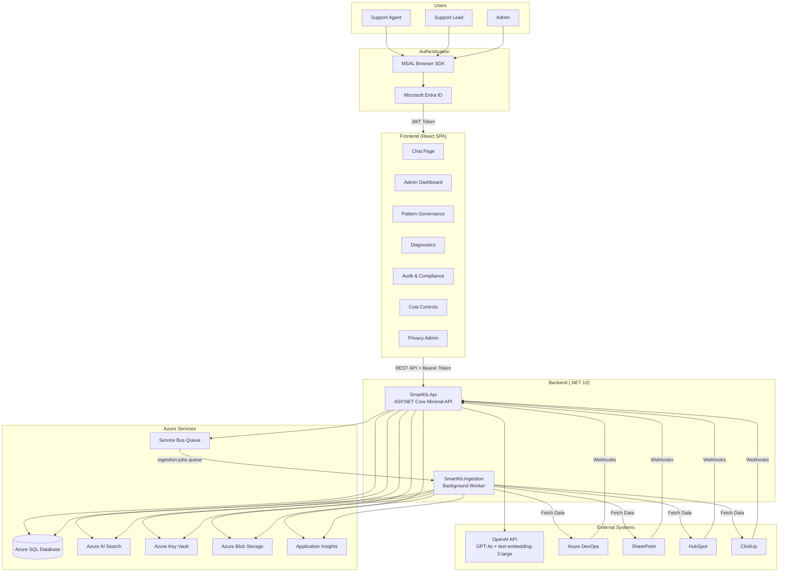

---

## 2. Azure Infrastructure

```mermaid
graph TB
    subgraph RG["Resource Group: rg-smartkb-{env}"]
        subgraph Compute["Compute"]
            PLAN[App Service Plan<br/>plan-smartkb-{env}<br/>B1/P1v3]
            API_APP[Web App: API<br/>app-smartkb-api-{env}<br/>.NET 10]
            ING_APP[Web App: Ingestion<br/>app-smartkb-ingestion-{env}<br/>.NET 10]
            SWA[Static Web App<br/>stapp-smartkb-{env}<br/>React SPA]
        end

        subgraph Data["Data"]
            SQL_SVR[SQL Server<br/>sql-smartkb-{env}]
            SQL_DB[(SQL Database<br/>sqldb-smartkb-{env}<br/>Basic/S1)]
            STORAGE[Storage Account<br/>stsmartkb{env}]
            BLOB_CTR[Blob Container<br/>raw-content]
        end

        subgraph Search["Search & Messaging"]
            SRCH[Azure AI Search<br/>srch-smartkb-{env}<br/>basic/standard]
            SB_NS[Service Bus Namespace<br/>sb-smartkb-{env}]
            SB_Q[Queue: ingestion-jobs<br/>Max Delivery: 10<br/>Dead-letter enabled]
        end

        subgraph Security["Security"]
            KV[Key Vault<br/>kv-smartkb-{env}<br/>RBAC-enabled]
            CMK_ID[CMK Identity<br/>id-smartkb-cmk-{env}<br/>conditional]
        end

        subgraph Monitoring["Monitoring & Alerting"]
            LOG[Log Analytics<br/>log-smartkb-{env}]
            APPI[Application Insights<br/>appi-smartkb-{env}]
            AG[Action Group<br/>ag-smartkb-slo-{env}]
            ALERTS[Metric Alerts<br/>- Chat Latency P95<br/>- API Availability<br/>- Dead Letters<br/>- HTTP 5xx<br/>- Queue Backlog]
        end
    end

    PLAN --> API_APP & ING_APP
    SQL_SVR --> SQL_DB
    STORAGE --> BLOB_CTR
    SB_NS --> SB_Q
    APPI --> LOG
    ALERTS --> AG

    API_APP -.->|MI: SQL Admin| SQL_DB
    API_APP -.->|MI: Blob Contributor| STORAGE
    API_APP -.->|MI: Search Contributor| SRCH
    API_APP -.->|MI: SB Data Sender| SB_Q
    API_APP -.->|MI: KV Secrets User| KV
    API_APP -.->|Telemetry| APPI

    ING_APP -.->|MI: Blob Contributor| STORAGE
    ING_APP -.->|MI: Search Contributor| SRCH
    ING_APP -.->|MI: SB Data Receiver| SB_Q
    ING_APP -.->|MI: KV Secrets User| KV
    ING_APP -.->|Telemetry| APPI

    CMK_ID -.->|MI: KV Crypto Officer| KV
```

---

## 3. RAG Pipeline (Chat Flow)

```mermaid
flowchart TB
    USER[User Query] --> CLASSIFY

    subgraph PreRetrieval["Stage 1: Pre-Retrieval"]
        CLASSIFY[Query Classification<br/>gpt-4o-mini]
        CLASSIFY --> |category, product_area,<br/>severity, filters| EMBED
        EMBED[Generate Embedding<br/>text-embedding-3-large<br/>1536 dimensions]
        CACHE{Embedding<br/>Cache Hit?}
        EMBED --> CACHE
        CACHE -->|Yes| RETRIEVE
        CACHE -->|No| OPENAI_EMB[OpenAI Embedding API]
        OPENAI_EMB --> RETRIEVE
    end

    subgraph Retrieval["Stage 2: Hybrid Retrieval (Parallel)"]
        RETRIEVE[Retrieval Request] --> EV_IDX & PAT_IDX

        subgraph EvidenceSearch["Evidence Index"]
            EV_IDX[Azure AI Search<br/>evidence-index]
            EV_IDX --> |BM25 + Vector| EV_RRF[Reciprocal Rank Fusion]
        end

        subgraph PatternSearch["Pattern Index"]
            PAT_IDX[Azure AI Search<br/>pattern-index]
            PAT_IDX --> |BM25 + Vector| PAT_RRF[Reciprocal Rank Fusion]
        end
    end

    subgraph Filtering["Stage 3: Security & Filtering"]
        EV_RRF & PAT_RRF --> ACL[ACL Security Trimming]
        ACL --> |Remove inaccessible| FUSE[Fused Ranking]
        FUSE --> |Trust boost, recency,<br/>diversity constraints| NOEV{Has Evidence?}
    end

    subgraph Generation["Stage 4: Response Generation"]
        NOEV -->|Yes| PII[PII Redaction]
        NOEV -->|No: < 3 results or<br/>scores < 0.3| NEXTSTEPS[Next Steps Only<br/>+ Escalation Signal]
        PII --> BUDGET[Token Budget<br/>Enforcement]
        BUDGET --> PROMPT[Assemble System Prompt<br/>+ Context + History]
        PROMPT --> LLM[OpenAI GPT-4o<br/>Structured Output]
    end

    subgraph PostProcess["Stage 5: Post-Processing"]
        LLM --> CONF[Confidence Blending<br/>Model + Retrieval Heuristic]
        CONF --> ESC{Escalation<br/>Signal?}
        ESC -->|Yes| DRAFT[Auto-Draft<br/>Escalation]
        ESC -->|No| TRACE
        DRAFT --> TRACE[Write Answer Trace<br/>+ Audit Event]
    end

    TRACE --> RESP[Chat Response<br/>answer, citations, confidence,<br/>next_steps, escalation]
    NEXTSTEPS --> RESP
```

---

## 4. Data Ingestion Pipeline

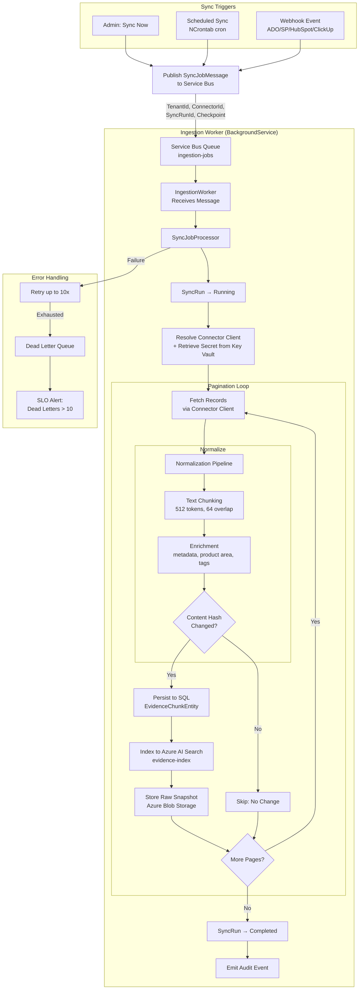

---

## 5. Pattern Distillation & Governance

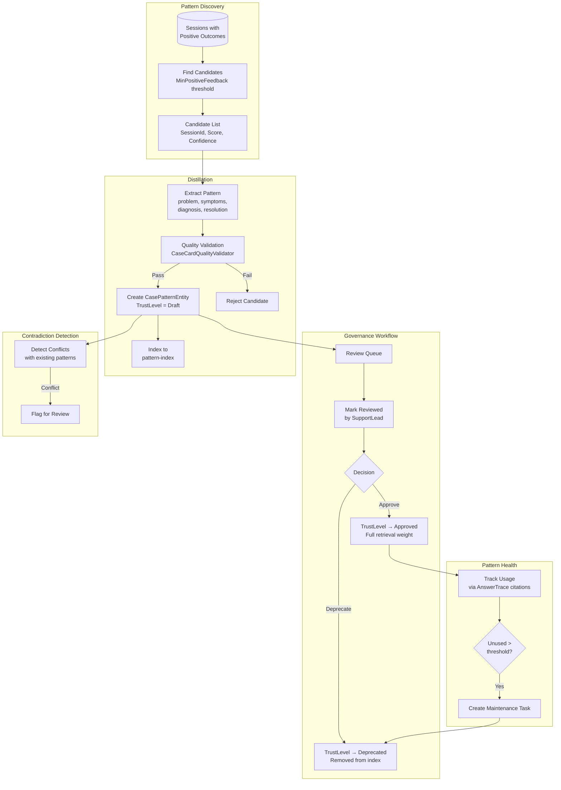

---

## 6. Security & Multi-Tenancy

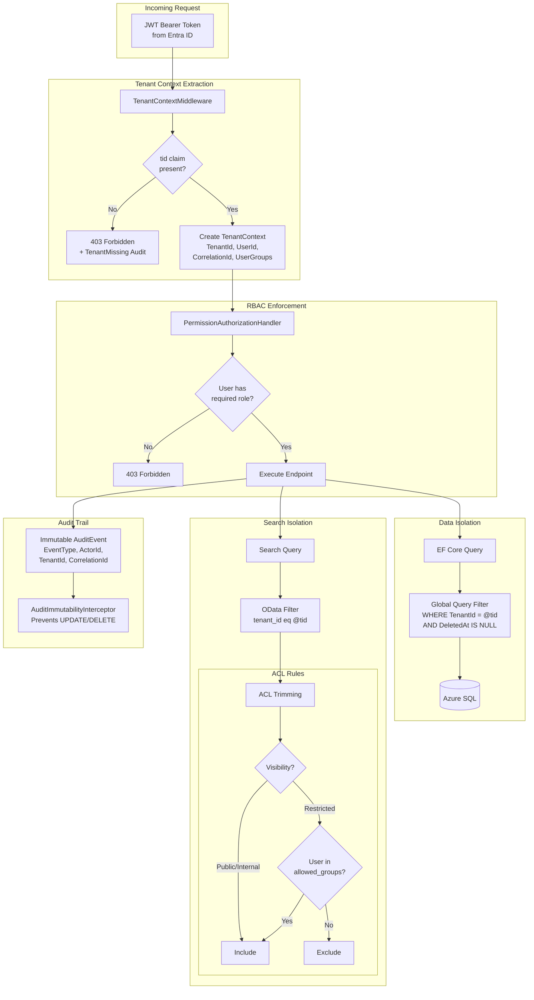

---

## 7. RBAC Role-Permission Matrix

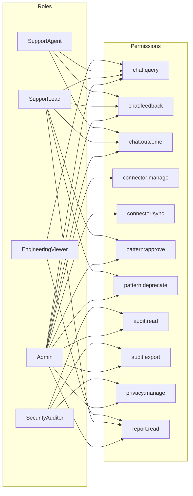

---

## 8. .NET Project Dependency Graph

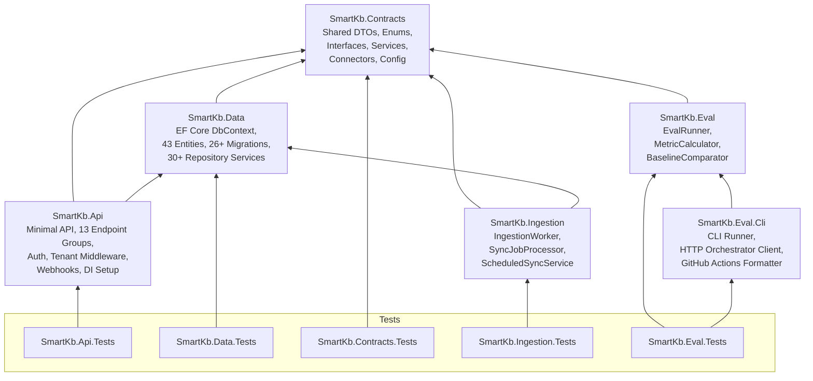

---

## 9. Frontend Component Hierarchy

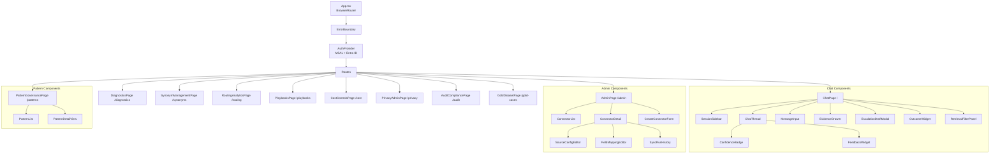

---

## 10. Data Model (Core Entities)

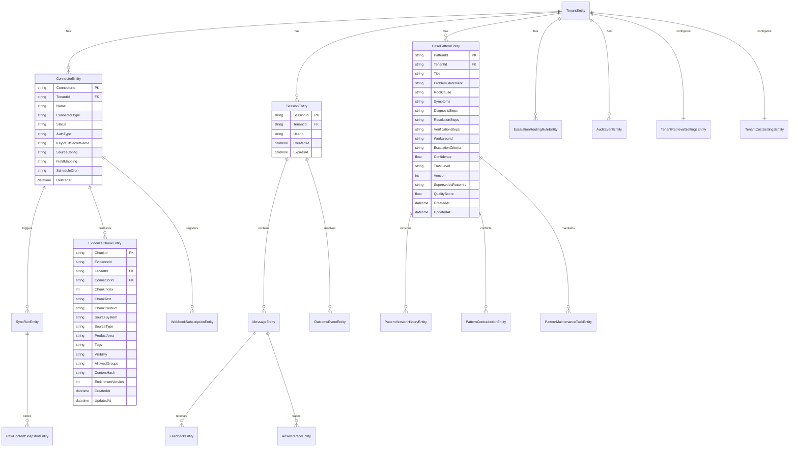

---

## 11. CI/CD Pipeline

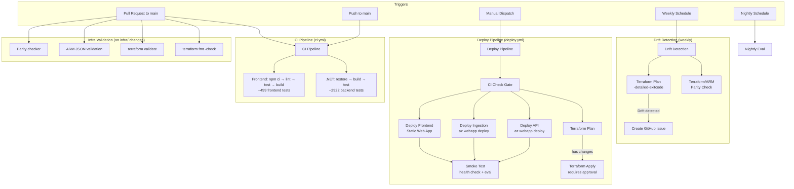

---

## 12. Two-Store Search Architecture

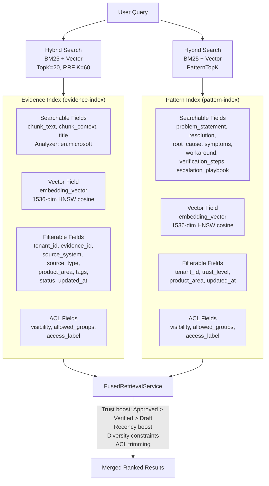

---

## 13. Connector Data Flow

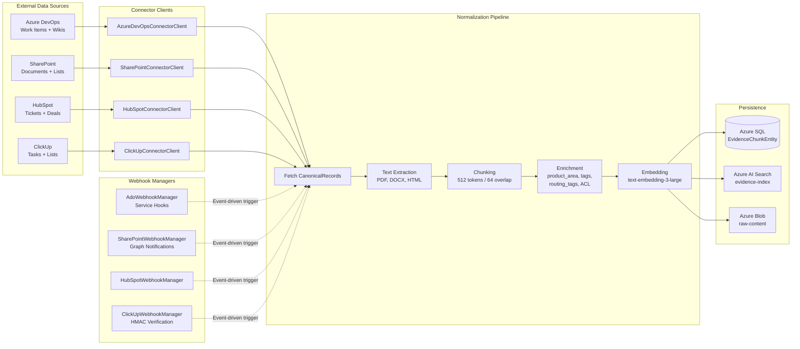

---

## 14. Escalation Flow

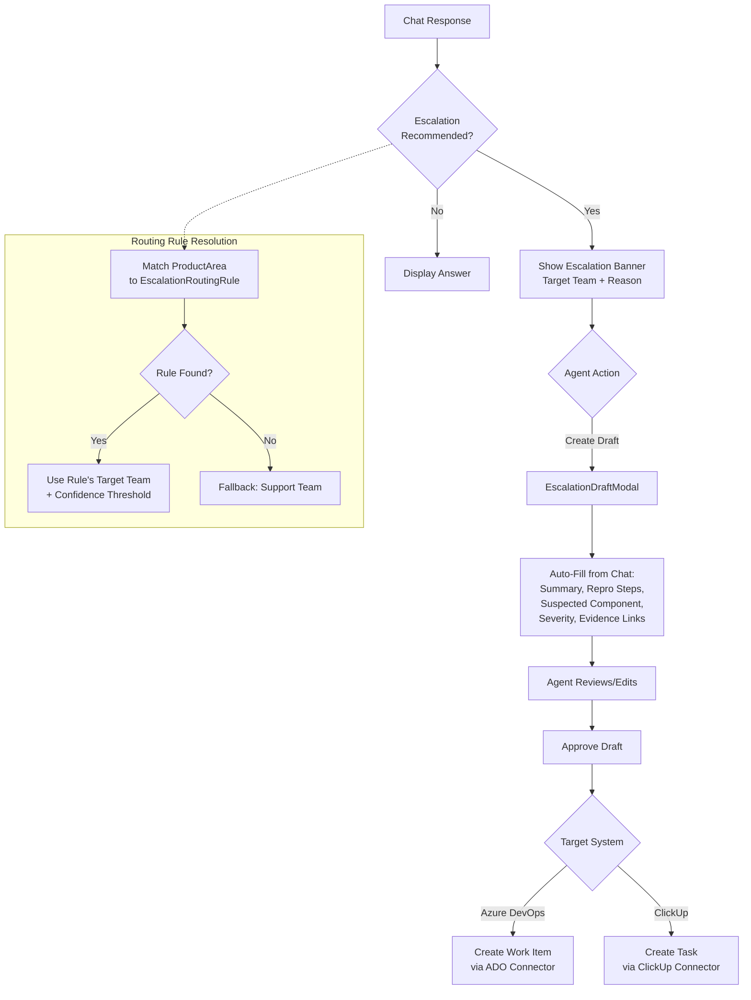

---

## 15. Observability Stack

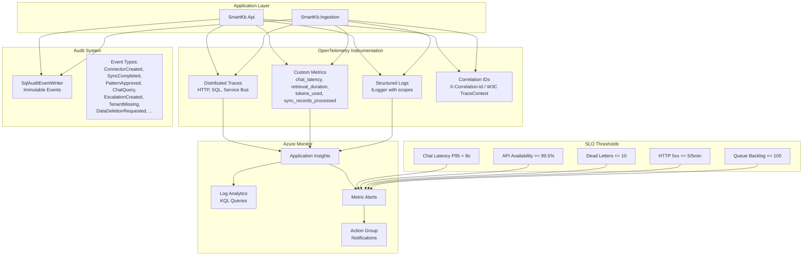

---

## 16. Environment Comparison

| Resource | Dev | Staging | Prod |
|----------|-----|---------|------|
| App Service Plan | B1 | P1v3 | P1v3 |
| SQL Database | Basic | S1 | S1 |
| Azure AI Search | basic | standard | standard |
| Service Bus | Basic | Standard | Standard |
| Static Web App | Free | Standard | Standard |
| CMK Encryption | Off | Optional | Optional |
| Always-On | Off | On | On |
| SLO Alerts | Disabled | Enabled | Enabled |
| Purge Protection | Off | Off | Auto-enabled |
| Terraform State | smartkb-dev.tfstate | smartkb-staging.tfstate | smartkb-prod.tfstate |
| Deploy Approval | No | No | Required |

---

## 17. Test Coverage

| Layer | Project | Tests | Focus |
|-------|---------|-------|-------|
| API | SmartKb.Api.Tests | ~900+ | Endpoint integration, auth, tenant isolation, RBAC |
| Data | SmartKb.Data.Tests | ~800+ | Repository services, EF Core, migrations |
| Contracts | SmartKb.Contracts.Tests | ~700+ | DTOs, services, connectors, search, enrichment |
| Ingestion | SmartKb.Ingestion.Tests | ~200+ | SyncJobProcessor, worker lifecycle, scheduling |
| Eval | SmartKb.Eval.Tests | ~100+ | Metrics, baseline comparison, CLI runner |
| Frontend | frontend (Vitest) | ~499 | Component rendering, API client, interactions |
| **Total** | | **~3421** | |

---

## 18. Key Design Decisions

| Decision | Choice | Rationale |
|----------|--------|-----------|
| RAG Architecture | Two-store (Evidence + Pattern) | Evidence for auditability; Patterns for reusability |
| Search Strategy | Hybrid BM25 + Vector + RRF | Best recall across keyword and semantic queries |
| Embedding Model | text-embedding-3-large (1536d) | High quality, good cost/performance balance |
| LLM | GPT-4o (Structured Outputs) | Reliable JSON schema enforcement |
| Auth | Entra ID + MSAL | Enterprise SSO, tenant isolation via `tid` claim |
| IaC | Terraform + ARM (dual) | Terraform for state; ARM for Azure-native deployment |
| Messaging | Azure Service Bus | Dead-lettering, retry policies, managed identity |
| Multi-tenancy | Row-level via EF Core global filters | Simple, secure, consistent enforcement |
| Secret Management | Azure Key Vault + Managed Identity | No secrets in code or config |
| Frontend | React + Vite (no state library) | Simple local state; no Redux overhead needed |
