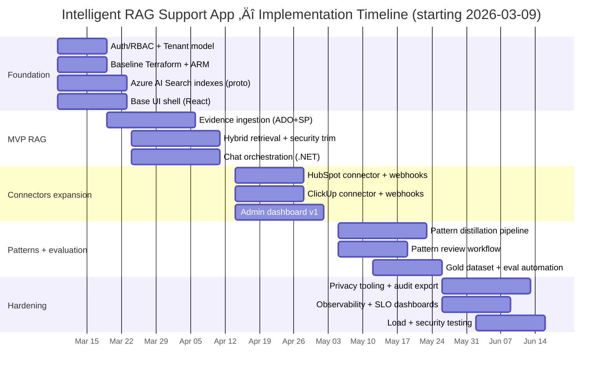

# Intelligent RAG Customer Support App PRD Bundle

This PRD is grounded in official platform capabilities you specified: OpenAI API (API keys, Responses API, embeddings, function/tool calling, and Structured Outputs) citeturn0search0turn4search1turn4search2turn4search5turn4search0 and Azure AI Search for hybrid retrieval (BM25 + vector), Reciprocal Rank Fusion (RRF), and semantic reranking citeturn5search14turn2search33turn2search5turn2search1, plus Azure identity and secret-management primitives (Managed Identities and Key Vault) citeturn3search2turn3search7turn3search1. It also reflects official ingestion mechanisms for your external sources: Azure DevOps Service Hooks/webhooks citeturn1search0turn1search4, HubSpot Tickets + Webhooks citeturn0search3turn0search7, ClickUp Webhooks + signature verification citeturn1search2turn1search13, and SharePoint via Microsoft Graph delta + change notifications citeturn0search6turn0search10turn0search2. Document-level access control guidance for Azure AI Search is referenced for “security-trimmed RAG” citeturn2search2turn2search6turn2search26.

## 00-executive-summary.md

````markdown
# Intelligent RAG Customer Support App — Product Requirements Document (PRD)

**Document status:** Draft (v0.9)  
**Date:** 2026-03-06 (Asia/Manila)  
**Owner:** Product / Engineering  
**Stakeholders:** Support Operations, Customer Success, Engineering (Dev), Security/Compliance, IT/Admin  
**Target users:** Internal customer support agents and support leads (initial release)

## Executive summary

Customer support teams are currently forced to answer customer inquiries by manually searching across fragmented systems: Azure DevOps wiki and work items, HubSpot tickets, ClickUp docs and tasks, and SharePoint documents. The result is inconsistent answers, slow time-to-resolution, and repeated escalations due to missing context.

This product will deliver an **intelligent RAG-based customer support app** that:
- Produces **grounded answers with citations** from enterprise sources.
- Performs **issue understanding and triage** (classification, severity, product area, customer impact).
- Suggests **next steps** (what to ask, what to check) when a clear solution is not found.
- Recommends **escalation routing** to the correct team (e.g., Software Development) with a structured handoff note.
- Continuously improves via **fresh content ingestion** (new tickets/docs) and **feedback loops** (agent ratings, edits, outcomes).

The “intelligence” is achieved not by training the base model on private data, but by a complete system design:
1) robust ingestion and normalization
2) two-store knowledge strategy (Evidence Store + Case-Pattern Store)
3) hybrid retrieval with ranking and security trimming
4) orchestration flows for decision support and escalation
5) evaluation and continuous improvement loops.

## Product vision

A support agent can paste a customer request and immediately receive:
- a concise answer (or troubleshooting steps),
- a confidence rating and why,
- the exact cited evidence (quotes/snippets with source links),
- a recommended owner/team if escalation is needed,
- a prefilled escalation note and checklist.

## Goals (high-level)

- Reduce time for support agents to find accurate answers.
- Increase answer consistency and reduce reliance on tribal knowledge.
- Improve routing accuracy for escalations (fewer wrong handoffs).
- Create an organization-wide memory of “what happened and how it was solved” by distilling solved cases into reusable patterns.

## Non-goals (initial releases)

- Fully autonomous ticket resolution without human review/approval.
- Automatic production changes or deployments.
- Replacing existing ticketing systems (HubSpot, Azure DevOps, ClickUp) — the app integrates with them.

## Scope summary

### In scope
- React web app for support agents: chat + evidence viewer + escalation workflow.
- .NET backend: auth, orchestration, retrieval, ingestion, feedback logging.
- Azure AI Search for hybrid retrieval and indexing.
- Azure Blob/Files for content storage (raw documents and snapshots).
- Azure SQL for normalized records, pattern metadata, audit trails, feedback, connector config, and secret references.
- Azure Functions for ingestion jobs + webhook processing.
- Admin console: connectors, mapping, sync controls, health monitoring.
- Fixed OpenAI API configuration stored server-side in application settings or environment configuration.

### Out of scope (initial)
- Voice channel support.
- Direct customer-facing chatbot (phase-later, after safety hardening).
- Training custom LLMs as a primary improvement mechanism (optional future exploration).

## Success definition

The product is successful if:
- Support agents adopt it daily and measurably reduce “time to find answers”.
- Answers are grounded with evidence; hallucinations are rare, detectable, and correctable.
- Escalations are routed with higher accuracy and better handoff quality.
- The knowledge base improves over time via ingestion + feedback.

## Summary of key system concepts

**Two-store knowledge design**
- **Evidence Store:** chunked, indexed raw content (tickets, wiki pages, docs) used for citations and auditability.
- **Case-Pattern Store:** distilled “problem → diagnosis → solution / escalation playbook” patterns extracted from solved tickets and curated artifacts.

**Orchestration**
- Classify ‚Üí Retrieve ‚Üí Answer/Next-step Plan ‚Üí Escalation Suggestion (if needed) ‚Üí Feedback Capture.

**Continuous learning**
- Ingest new items (webhooks + delta sync + polling fallback).
- Distill solved tickets into patterns.
- Use feedback and outcomes to tune retrieval and routing.
- Track evaluation metrics using a gold dataset.

````

## 10-goals-personas-journeys.md

This section’s design assumes: (a) hybrid search is available for combining full-text and vector retrieval citeturn2search33turn0search1, (b) semantic ranker can rerank results and produce extractive captions/answers for better evidence display citeturn2search1turn2search13, and (c) SharePoint/Graph can maintain freshness through delta query and change notifications rather than heavy polling citeturn0search6turn0search10.

````markdown
# Goals, success metrics, user personas, and journeys

## Problem statement

Support knowledge is fragmented across multiple systems, each with different structures, permissions, and update dynamics. Agents must “hunt” for answers, leading to:
- slower resolution times,
- inconsistent answers,
- repeated escalations,
- loss of institutional knowledge when staff change.

## Objectives

### Product objectives
- Provide a single interface to search across support evidence and generate grounded answers with citations.
- Reduce cognitive load by extracting problem summaries, likely causes, and suggested next actions.
- Improve the quality and speed of escalation routing with structured handoffs.
- Convert solved cases into reusable patterns to prevent repeat work.

### Engineering objectives
- Ensure secure access control and auditability for all retrieved content.
- Enable reliable ingestion pipelines with incremental updates, failure handling, and observability.
- Provide evaluation tools and datasets to measure quality over time.

## Success metrics

### Adoption and productivity metrics
- Weekly active users (support agents) / total eligible users.
- Median time-to-first-answer (TTFA) in the app.
- Median time-to-resolution (TTR) for tickets (relative delta vs baseline).
- Self-service deflection rate (cases resolved without escalation) – only where policy allows.

### Answer quality metrics
- “Helpful” rating (% thumbs-up).
- Citation coverage (% answers with at least N citations).
- Groundedness / faithfulness score (evaluation-defined).
- Safety refusal correctness rate (when system should decline).

### Routing and escalation metrics
- Escalation recommendation acceptance rate.
- Wrong-team escalation rate (agent or downstream team flags misrouting).
- Time-to-assign (TTA) after escalation and handoff completeness score.

### Knowledge growth metrics
- Number of new case patterns created per week.
- Pattern re-use rate (patterns referenced by answers).
- Staleness rate (patterns flagged outdated vs total patterns).

## Constraints and assumptions

- Multi-tenant support: each “tenant” corresponds to an org/team boundary; data must not leak cross-tenant.
- The application uses a fixed server-side OpenAI API key; it must never be exposed in browser code and must support controlled rotation.
- Source systems have their own permission models; the app must respect them, not bypass them.
- Some sources are noisy (tickets/comments); the system must communicate confidence and show evidence.

## User personas

### Support agent (Tier 1 / Tier 2)
**Primary job:** answer customer questions quickly and correctly.  
**Needs:** concise answer + evidence + next steps + fast escalation when needed.

### Support lead / QA
**Primary job:** ensure answer consistency, reduce escalations, improve SLA performance.  
**Needs:** dashboards for adoption & quality, feedback triage, pattern approval workflows.

### Knowledge administrator (Ops / Admin)
**Primary job:** connect sources, maintain mappings, manage permissions, monitor sync health.  
**Needs:** connector setup UI, sync controls, troubleshooting tools, audit access, retention controls.

### Engineering triage / Software development
**Primary job:** receive high-quality escalations with reproducible details.  
**Needs:** structured handoff (symptoms, environment, logs, repro steps, evidence), correct severity.

### Security/Compliance reviewer
**Primary job:** ensure control over access, PII handling, and auditability.  
**Needs:** RBAC, audit logs, retention policies, DLP/PII support, incident response workflows.

## Key user journeys

### Journey A: Answer an inquiry with evidence
1. Agent pastes customer inquiry into the chat.
2. System classifies the issue and retrieves evidence.
3. System generates an answer with citations and a confidence indicator.
4. Agent opens evidence snippets and verifies.
5. Agent sends response to customer (copy/export) and logs outcome.

**Success criteria:** agent resolves without escalation; answer is helpful; citations are relevant.

### Journey B: No clear solution ‚Üí next steps
1. Agent submits inquiry.
2. Retrieval finds low-confidence or incomplete evidence.
3. System outputs a “Next steps checklist”:
   - top clarifying questions to ask customer,
   - diagnostic checks to run,
   - what data/logs to request,
   - what keywords/error codes to search.
4. Agent collects info; re-asks question with new details.

**Success criteria:** system reduces guesswork; agent collects the right missing information.

### Journey C: Escalate to another department (e.g., Dev)
1. Agent submits inquiry.
2. System determines escalation criteria met (policy + confidence threshold).
3. System recommends target team and produces a structured handoff note.
4. Agent reviews and triggers creation of a ticket (Azure DevOps or ClickUp) or links to HubSpot.
5. System tracks outcome (accepted by team, rerouted, resolved).

**Success criteria:** fewer wrong-team escalations; better handoff completeness; reduced time-to-assign.

### Journey D: Admin connects sources and verifies data mapping
1. Admin opens Admin Dashboard → “Connectors”.
2. Chooses source type (ADO, HubSpot, ClickUp, SharePoint).
3. Completes auth + selects scope (projects/sites/workspaces/pipelines).
4. Maps source fields to canonical schema.
5. Runs a test sync and validates sample records.
6. Schedules incremental sync + sets retention rules.

**Success criteria:** connector setup is self-serve; minimal engineer intervention; clear health reporting.

### Journey E: Continuous improvement with feedback
1. Agent provides thumbs up/down and optional comments.
2. System logs answer, retrieved evidence IDs, and feedback.
3. Support lead reviews negative feedback queue and approves improvements.
4. Pattern distillation jobs convert newly solved tickets into patterns.
5. Weekly evaluation run computes metrics on gold dataset.

**Success criteria:** quality improves over time; regressions detected early.

````

## 20-features-and-requirements.md

Key requirements below assume (a) OpenAI Responses API is used for orchestration and can be combined with application-defined tools (function calling) citeturn4search1turn4search5 and (b) Structured Outputs can enforce reliable JSON schemas for classification/routing outputs citeturn4search0turn4search4. For search-based user experience, semantic ranking can support extractive captions/answers for better evidence display citeturn2search13turn2search9.

````markdown
# Features, requirements, admin dashboard, and UX specs

## Product scope and prioritization

### MVP (Phase 1)
- Support Agent Chat UI (React)
- Hybrid retrieval from Azure AI Search (Evidence Store)
- Answer generation with citations
- “Next steps” planning when solution not found
- Escalation recommendation (team routing) + handoff note
- Feedback capture (thumbs up/down, reason codes)
- Admin dashboard: connectors setup + manual sync + health view
- Source permission enforcement (security trimming)
- Basic evaluation harness (gold dataset + run reports)
- Baseline Terraform + ARM coverage for core Azure resources

### V1 (Phase 2)
- Case-pattern distillation pipeline (solved tickets ‚Üí patterns)
- Case Pattern Store retrieval and answer synthesis (patterns + evidence)
- Advanced filters (customer, product version, environment)
- Approval workflow for patterns (support lead)
- Automatic ticket draft creation (ADO/ClickUp) with human approval
- IaC hardening and drift checks
- Observability dashboards (SLO, errors, pipeline health)

### V2+ (Phase 3+)
- Automated routing suggestions embedded into HubSpot workflows
- Team-specific playbooks and policy enforcement (e.g., billing vs dev)
- Multi-lingual support if required by business
- Optional advanced model customization (distillation/fine-tuning) after rigorous safety + eval gates

## Functional requirements

### Chat-based support copilot
- FR-CHAT-001: Agent can submit an inquiry and receive a response within latency SLO.
- FR-CHAT-002: Response includes:
  - Answer or recommended next steps.
  - Confidence indicator and “why” rationale.
  - Evidence citations (links to source items + retrieved snippets).
- FR-CHAT-003: Agent can open “Evidence Drawer” to view:
  - snippet text,
  - source type and location (HubSpot ticket, ADO wiki, etc.),
  - timestamp,
  - access label and permission scope.
- FR-CHAT-004: Agent can ask follow-up questions; the system maintains session context.

### Triage and classification
- FR-TRIAGE-001: The system classifies each inquiry into:
  - issue category,
  - product area/module,
  - severity/impact,
  - likelihood it requires escalation.
- FR-TRIAGE-002: The system suggests missing information to request when confidence is low.

### Escalation routing and delegation
- FR-ESC-001: System suggests escalation target team and reason.
- FR-ESC-002: System drafts a handoff note with required fields:
  - customer summary,
  - steps to reproduce,
  - logs/IDs requested,
  - suspected component,
  - evidence links,
  - priority/severity recommendation.
- FR-ESC-003: Agent can create a new work item/task (draft) in ADO or ClickUp.
- FR-ESC-004: System tracks escalation outcome to improve routing (accepted, rerouted, resolved).

### Knowledge distillation and case patterns
- FR-PATTERN-001: For solved tickets, the system extracts:
  - canonical problem statement,
  - root cause (if known),
  - resolution steps,
  - workaround,
  - verification steps,
  - escalation playbook,
  - applicability constraints (product version, environment).
- FR-PATTERN-002: Patterns are versioned and can be deprecated or superseded.
- FR-PATTERN-003: Patterns can be:
  - auto-created (low-trust) and queued for review,
  - approved by support lead (high-trust).

### Feedback and outcomes
- FR-FB-001: In-app feedback:
  - thumbs up/down,
  - “why not helpful” tags,
  - optional free-text comment,
  - ability to propose corrected answer.
- FR-FB-002: Agents can mark “used this answer to resolve ticket” (outcome event).
- FR-FB-003: Feedback updates relevance tuning and pattern review queue.

## Non-functional requirements

### Security & compliance
- NFR-SEC-001: User authentication via Microsoft Entra ID (SSO).
- NFR-SEC-002: Document-level access enforcement (security trimming).
- NFR-SEC-003: Audit trail for:
  - user queries,
  - documents retrieved,
  - answers delivered,
  - actions taken (ticket creation, pattern approval).
- NFR-SEC-004: PII handling policies:
  - detection/tagging,
  - minimization by default,
  - configurable redaction rules.

### Reliability and performance
- NFR-PERF-001: P95 “answer-ready” latency ≤ 8 seconds for typical queries (configurable).
- NFR-PERF-002: Ingestion pipelines tolerate transient failures and retry with backoff.
- NFR-PERF-003: Idempotent processing; no duplicate records on replay.
- NFR-PERF-004: Availability target ‚â• 99.5% for the app (Phase 1), higher later.

### Maintainability and operations
- NFR-OPS-001: Centralized logs, metrics, traces; correlation IDs across services.
- NFR-OPS-002: Per-tenant configuration and isolation.
- NFR-OPS-003: Simple rollback strategy for search schema changes.
- NFR-OPS-004: Every Azure resource must be represented in both Terraform and ARM templates.
- NFR-OPS-005: Infrastructure changes must validate Terraform and ARM artifacts in the same change set.

## Admin dashboard requirements

### Connector management
- ADM-001: Add new connector instance per tenant:
  - Azure DevOps (wiki + work items),
  - HubSpot tickets,
  - ClickUp docs + tasks,
  - SharePoint document libraries.
- ADM-002: Configure auth (OAuth / tokens), with secure stored secrets.
- ADM-003: Select scope:
  - ADO org/project(s) + wiki(s),
  - HubSpot pipelines and ticket filters,
  - ClickUp workspace + space/folder/list,
  - SharePoint sites/drives/folders.
- ADM-004: Field mapping UI:
  - map source fields ‚Üí canonical schema fields,
  - define transforms (regex extraction, normalization),
  - define routing tags (product/module mapping).
- ADM-005: Sync controls:
  - run full backfill,
  - run incremental sync now,
  - pause/resume,
  - schedule frequency,
  - view last success and failures.
- ADM-006: Preview & validation:
  - show sample normalized records,
  - test retrieval query against new data,
  - highlight missing required fields.
- ADM-007: Health and error diagnostics:
  - ingestion job status,
  - webhook delivery status (where applicable),
  - rate-limit/throttle alerts,
  - dead-letter queue viewer.

### Knowledge governance
- ADM-101: Pattern review queue with role-based approvals.
- ADM-102: Deprecate patterns and mark replacements.
- ADM-103: Manage stop-words, synonyms, and special tokens (error codes).
- ADM-104: Configure content retention and deletion policies per source.

## UX wireframe descriptions (text-only)

### Support Agent — Main screen
- Left sidebar:
  - Customer selector (optional), recent sessions, saved searches, “Patterns”.
- Center:
  - Chat thread with assistant messages.
  - Each assistant message shows:
    - answer body,
    - confidence badge,
    - “Evidence (N)” button,
    - “Escalate” button (if applicable),
    - feedback buttons.
- Right panel (contextual):
  - “Issue classification” card (category, module, severity).
  - “Next steps” checklist.
  - “Escalation suggestion” card (team + reason + draft note).

### Evidence drawer
- List of cited items with:
  - source icon,
  - title,
  - snippet excerpt,
  - timestamp and author,
  - permission label.
- Clicking opens “Source Viewer”:
  - rendered markdown/wiki,
  - ticket details,
  - doc preview (read-only),
  - copy citation link.

### Escalation modal
- Shows recommended target team and default priority.
- Editable structured fields (prefilled).
- Buttons:
  - “Create draft in Azure DevOps”
  - “Create draft in ClickUp”
  - “Copy handoff note”
  - “Cancel”

### Admin — Connectors screen
- Connector tiles with status:
  - Connected / Error / Syncing / Paused
- “Add connector” wizard:
  - choose type ‚Üí auth ‚Üí scope ‚Üí mapping ‚Üí test ‚Üí activate

### Admin — Observability screen
- Charts:
  - ingestion lag,
  - indexing lag,
  - query volume,
  - p95 latency,
  - “no-evidence” rate,
  - feedback trend.

````

## 30-data-model-and-knowledge-schema.md

This section reflects an Azure AI Search-centric design where vectors and text live together in the same index (vector store capability) citeturn2search8turn2search0 and where document-level security can be implemented via filter-based trimming or permission ingestion patterns citeturn2search2turn2search6turn2search26. It also anticipates incremental sync patterns driven by delta links for Microsoft Graph citeturn0search6turn0search2.

````markdown
# Canonical support knowledge schema and data model

## Design principles
- **Traceability:** Every answer must trace back to evidence.
- **Separation of concerns:** Raw evidence vs distilled reusable patterns.
- **Versioning and freshness:** Track revisions, staleness, and supersession.
- **Security by design:** Carry ACL metadata through normalization and indexing.

## Two-store knowledge design

### Evidence Store (raw + normalized evidence)
Purpose:
- Provide auditable, citeable grounding.
- Preserve “what was actually said/written” in tickets and docs.
- Support exact quotes/snippets and source deep links.

Contents:
- Chunked content with metadata
- Attachments extracted to text where possible
- Ticket conversations, comments, wiki pages, SOPs

Recommended storage:
- Blob Storage / Files: raw snapshots (html/md/pdf/docx) + extracted text
- Azure SQL: normalized metadata + relationships
- Azure AI Search “evidence index”: chunk documents with vector fields + BM25 fields

### Case-Pattern Store (distilled “problem → solution playbooks”)
Purpose:
- Provide higher-signal reusable support knowledge.
- Enable faster answers and consistent escalations.
- Capture “how a problem was solved” and “how to proceed when not solved”.

Contents:
- Structured case pattern records extracted from solved tickets and curated docs.
- Approval status and trust level metadata.

Recommended storage:
- Azure SQL for pattern metadata/workflow + Azure AI Search "pattern index"
- Optional CSV/JSON export for offline evaluation and review.

## Canonical schema

### Entity: EvidenceRecord (normalized metadata)
Required fields:
- tenant_id (string)
- evidence_id (string, unique)
- source_system (enum): azure_devops | hubspot | clickup | sharepoint
- source_type (enum): wiki_page | work_item | ticket | task | doc | comment | attachment
- source_locator (object): stable identifiers (ids + URLs stored as strings)
- title (string)
- author (string, optional)
- created_at (datetime)
- updated_at (datetime)
- status (enum): open | closed | draft | archived | deleted
- text_content (string) — normalized full text (pre-chunk)
- language (string, default en-US)
- tags (string[])
- customer_refs (string[]) — e.g., customer_id, tenant_name, domain
- product_area (string, optional)
- severity (string, optional)
- permissions (object): ACL metadata, groups/users, visibility labels
- content_hash (string) — for dedup/etag semantics

Optional fields:
- parent_evidence_id (string) — e.g., comment → ticket
- thread_id (string)
- attachment_refs (array)
- pii_flags (array)
- sensitivity_label (string)

### Entity: EvidenceChunk (retrieval unit for Evidence Index)
- chunk_id (string, unique)
- tenant_id (string)
- evidence_id (string)
- chunk_index (int)
- chunk_text (string)
- chunk_context (string) — “header path” / surrounding context
- embedding_vector (float[]) — from embedding model
- bm25_text (string) — same as chunk_text or enriched text
- metadata fields duplicated for filtering: source_system, source_type, product_area, updated_at, tags, etc.
- permissions fields persisted for security trimming

### Entity: CasePattern (distilled reusable record)
Required fields:
- tenant_id (string)
- pattern_id (string)
- title (string)
- problem_statement (string)
- symptoms (string[])
- environment (object): product_version, platform, integration, region
- diagnosis_steps (string[])
- resolution_steps (string[])
- verification_steps (string[])
- workaround (string, optional)
- escalation_criteria (string[])
- escalation_target (object): team, role, queue, link
- related_evidence_ids (string[]) — tickets/docs that justify this pattern
- confidence (0..1)
- trust_level (enum): draft | reviewed | approved | deprecated
- created_at, updated_at
- version (int)
- supersedes_pattern_id (string, optional)
- applicability_constraints (string[])
- exclusions (string[])

Optional fields:
- known_risks (string[])
- customer_impact_notes (string)
- automation_candidates (string[]) — tasks that can be automated later

## Data model (Azure)

### Azure AI Search indexes
1) evidence-index
- Primary key: chunk_id
- Searchable fields: chunk_text, chunk_context, title, tags, product_area
- Filterable fields: tenant_id, source_system, source_type, product_area, updated_at, status, ACL fields
- Vector fields: embedding_vector (dimensions = embedding model output)

2) pattern-index
- Primary key: pattern_id
- Searchable fields: title, problem_statement, symptoms, resolution_steps
- Filterable: tenant_id, trust_level, product_area, updated_at
- Vector fields: pattern_embedding_vector

### Azure SQL logical tables
- tenants
- connector_configs
- sync_runs
- evidence_records (metadata)
- case_patterns
- feedback_events
- audit_events

## Concrete examples

### Example: Normalized EvidenceRecord (HubSpot ticket)
```json
{
  "tenant_id": "expertcollege-support",
  "evidence_id": "hubspot-ticket-987654",
  "source_system": "hubspot",
  "source_type": "ticket",
  "source_locator": {
    "object_id": "987654",
    "pipeline_id": "support-pipeline-1",
    "url": "hubspot://tickets/987654"
  },
  "title": "Customer cannot login after SSO change",
  "author": "agent@company.com",
  "created_at": "2026-02-25T09:13:21Z",
  "updated_at": "2026-02-25T11:07:02Z",
  "status": "closed",
  "text_content": "Customer reports SSO loop. Steps tried: ... Resolution: cleared SAML metadata cache ...",
  "language": "en-US",
  "tags": ["sso", "login", "saml"],
  "customer_refs": ["customer:contoso", "domain:contoso.com"],
  "product_area": "Authentication",
  "severity": "P2",
  "permissions": {
    "visibility": "internal",
    "allowed_groups": ["Support", "Engineering-Auth"]
  },
  "content_hash": "sha256:6b7b..."
}
```

### Example: EvidenceChunk (retrieval unit)
```json
{
  "chunk_id": "hubspot-ticket-987654#chunk-03",
  "tenant_id": "expertcollege-support",
  "evidence_id": "hubspot-ticket-987654",
  "chunk_index": 3,
  "chunk_context": "Resolution",
  "chunk_text": "Resolution: cleared SAML metadata cache in IdP and re-imported certificate; user could login within 10 minutes.",
  "embedding_vector": [0.012, -0.044, 0.031],
  "source_system": "hubspot",
  "source_type": "ticket",
  "product_area": "Authentication",
  "updated_at": "2026-02-25T11:07:02Z",
  "permissions": { "allowed_groups": ["Support", "Engineering-Auth"] }
}
```

### Example: CasePattern (distilled)
```json
{
  "tenant_id": "expertcollege-support",
  "pattern_id": "pattern-auth-sso-loop-cache-v3",
  "title": "SSO login loop after IdP metadata/certificate rotation",
  "problem_statement": "Users get redirected in an SSO loop after certificate rotation or SAML metadata update.",
  "symptoms": ["SSO loop", "SAML signature validation errors", "login redirects repeatedly"],
  "environment": { "integration": "SAML", "product_version": ">=2025.12" },
  "diagnosis_steps": [
    "Confirm certificate rotation date/time and affected tenant(s).",
    "Check IdP metadata cache and signing certificate validity.",
    "Inspect auth logs for signature/issuer mismatch."
  ],
  "resolution_steps": [
    "Clear IdP metadata cache (if applicable).",
    "Re-import current SAML metadata/certificate into both sides.",
    "Invalidate app auth session cache."
  ],
  "verification_steps": [
    "Ask user to retry in a fresh browser session.",
    "Confirm successful login and token issuance in logs."
  ],
  "workaround": "Temporarily bypass SSO using local admin login if policy allows.",
  "escalation_criteria": [
    "If signature mismatch persists after metadata refresh",
    "If multiple tenants impacted within 30 minutes"
  ],
  "escalation_target": { "team": "Engineering", "role": "Auth Oncall", "queue": "Auth-Bugs" },
  "related_evidence_ids": ["hubspot-ticket-987654", "ado-wi-45678"],
  "confidence": 0.78,
  "trust_level": "reviewed",
  "version": 3,
  "created_at": "2026-02-26T02:15:00Z",
  "updated_at": "2026-03-01T10:00:00Z",
  "applicability_constraints": ["SAML enabled tenants only"],
  "exclusions": ["OAuth-only tenants"]
}
```

## Schema governance rules
- Evidence is immutable-by-version: updates create new snapshot versions but maintain stable evidence_id mapping.
- Patterns require owner and approval status; only approved patterns can appear as “recommended standard fix.”
- Every pattern must reference at least one evidence record.

````

## 40-ingestion-and-connectors.md

Connector design below relies on official change/event mechanisms: Azure DevOps Service Hooks/webhooks can deliver JSON event payloads to your endpoint citeturn1search4turn1search0; HubSpot supports ticket APIs and webhooks subscriptions for CRM object events including tickets citeturn0search3turn0search7; ClickUp provides webhooks tied to the creating user token and signs requests with HMAC for verification citeturn1search2turn1search13; Microsoft Graph supports delta query to efficiently synchronize changes and change notifications to be alerted when resources change citeturn0search6turn0search10turn0search2. For SharePoint security-trimmed search, Azure AI Search provides documented security filter patterns and document-level access guidance citeturn2search2turn2search6turn2search26.

````markdown
# Ingestion pipelines and external connectors

## Ingestion architecture overview

### Objectives
- Keep Evidence Store and Pattern Store fresh with minimal manual work.
- Avoid duplicate ingestion and ensure idempotency.
- Preserve source-of-truth references and permissions metadata.

### High-level flow
1. **Connector configuration** (Admin Dashboard): store auth + scope + mapping rules.
2. **Backfill job** (Azure Functions): pull historical data within chosen date range.
3. **Incremental sync**:
   - Prefer **webhooks/event hooks** where available.
   - Use **delta sync** where supported (Graph).
   - Poll as fallback with “updated_since” windows.
4. **Normalization**: map to canonical schema; extract text; apply PII tagging; compute hashes.
5. **Chunking & embeddings**: create EvidenceChunks, generate vectors, enrich chunk context.
6. **Indexing**:
   - Upsert chunks into Azure AI Search evidence-index.
   - Upsert patterns into pattern-index.
7. **Observability**: log sync status; alert on failures and lag.

## Common connector requirements

### Authentication
- Support OAuth where available; otherwise support PAT/API token.
- Store external connector tokens and secrets in Key Vault; never store them in client code.
- Rotate secrets without downtime.

### Idempotency and replay
- Every inbound webhook event must have:
  - event_id (source-provided when possible),
  - received_at,
  - signature validation,
  - idempotency key (event_id + tenant_id).
- Indexing must be upsert-based; deletes must be explicit.

### Rate limiting & retries
- Implement exponential backoff for 429 / throttling.
- Queue-based processing for bursty webhook traffic.

### Text extraction
- Normalize markdown/html to plaintext + preserve structure (headings).
- For PDFs/docx: produce extracted text + store original.

### Chunking defaults (initial)
- Chunk size: 800–1200 tokens (configurable)
- Overlap: 10–15% overlap
- Chunk context: breadcrumb headings + source metadata header

## Source-specific connectors

## Azure DevOps connector (Wiki + Work Items)

### Data types
- Wiki pages (markdown) and revisions
- Work items: bugs, tasks, user stories, comments/history
- Optional: pull request discussions (future)

### Backfill strategy
- Wiki:
  - list wiki(s), enumerate pages, fetch page markdown and metadata
- Work items:
  - use WIQL queries for tickets in selected projects and date ranges
  - fetch work items in batches and include requested fields

### Incremental updates
- Primary: **Service Hooks / Webhooks**
  - Subscribe to events relevant to wiki page updates and work item changes.
- Secondary: polling
  - “updated_since” window using WIQL queries and updated-at filters.

### Normalization mapping examples
- Work item title ‚Üí EvidenceRecord.title
- Work item description + repro + comments ‚Üí EvidenceRecord.text_content
- Work item tags/area path ‚Üí product_area / tags
- Work item state ‚Üí status
- Work item revision ‚Üí content_hash computation inputs

### Webhook endpoint (example)
- POST /api/webhooks/azure-devops
- Validate:
  - tenant connector mapping
  - known subscription ID
  - optional shared secret (if configured)
- Enqueue processing to “ingestion-events” queue.

### Recommended event subscriptions (initial)
- Work item created/updated
- Wiki page created/updated

## HubSpot connector (Tickets)

### Data types
- Ticket objects
- Ticket properties and associations (contacts/companies)
- Ticket conversations/notes (as available)

### Backfill strategy
- Pull tickets from selected pipelines and date ranges.
- For each ticket:
  - fetch ticket record,
  - fetch relevant properties,
  - fetch timeline/notes if needed.

### Incremental updates
- Primary: **HubSpot Webhooks**
  - Subscribe to CRM object events for tickets.
- Secondary: polling by “updatedSince”.

### Normalization mapping examples
- Ticket subject ‚Üí title
- Ticket content + internal notes ‚Üí text_content
- Pipeline stage ‚Üí status
- Associations ‚Üí customer_refs

### Webhook endpoint (example)
- POST /api/webhooks/hubspot
- Validate:
  - known app/webhook signature method (per HubSpot docs)
  - idempotency keys

## ClickUp connector (Docs/Wiki + Tasks)

### Data types
- Docs (wiki content) and pages
- Tasks and comments/history items

### Backfill strategy
- Docs:
  - enumerate docs for selected workspace/scope
  - fetch page listings and pages
- Tasks:
  - list tasks from selected lists/folders/spaces

### Incremental updates
- Primary: **ClickUp Webhooks**
  - Subscribe to task created/updated and doc changes where supported.
  - Verify webhook signature (HMAC) with webhook.secret.
- Secondary: polling
  - fetch changed tasks by updated timestamp (windowed sync).

### Normalization mapping examples
- Doc title and headers ‚Üí chunk_context
- Task description + comments ‚Üí text_content
- Custom fields ‚Üí product_area / severity mapping rules

### Webhook endpoint (example)
- POST /api/webhooks/clickup
- Validate:
  - signature header per ClickUp HMAC docs
  - idempotency
- Enqueue.

## SharePoint connector (Docs)

### Data types
- Document libraries (driveItems)
- Lists/listItems (optional)
- Permissions metadata (ACL) for security trimming

### Backfill strategy (two options)
Option A: Custom Graph-based ingestion
- Enumerate sites/drives/folders in configured scope.
- Pull driveItems and download file content when allowed.
- Extract text and store in Blob.

Option B: Azure AI Search SharePoint indexer (if adopted later)
- Use built-in indexer approach for supported content + permission metadata ingestion.
- Note: preview constraints may apply; evaluate readiness before production.

### Incremental updates
- Primary: **Change notifications** (push) + **delta query** (pull)
  - Subscribe to changes for drives or lists.
  - Use delta tokens (@odata.deltaLink) to fetch only changes since last sync.
- Secondary: polling with delta links as fallback.

### Permission ingestion
- Carry SharePoint permission info into index fields (allowed users/groups) for document-level access enforcement.

## Distillation pipeline (tickets ‚Üí patterns)

### Trigger criteria
- Ticket/work item status changes to “closed/resolved”
- Support lead marks ticket “Solved and reusable”
- Recurring issue detected (N similar tickets within window)

### Extraction steps
1. Gather ticket details + comments + related artifacts.
2. Generate structured CasePattern draft (LLM) with schema validation.
3. Store draft with trust_level = draft and queue for review.
4. On approval, publish to pattern-index.

### Quality gates
- Must include at least 1 linked evidence_id.
- Must include verification steps.
- Must include applicability constraints.

## Ingestion operational requirements

### Failure handling
- Dead-letter queue for events that fail > N retries.
- Admin UI to replay dead-letter events once fixed.

### Data retention
- Maintain raw snapshots + extracted text per retention policy.
- Support “right to delete” requests and source-driven deletions.

### Observability (minimum)
- Sync lag per connector
- Webhook error rate and signature failures
- Indexing throughput and failures
- Pattern extraction success rate

````

## 50-retrieval-and-llm-orchestration.md

Retrieval design below uses official Azure AI Search’s hybrid query model (full-text + vector executed in parallel and merged with RRF) citeturn2search33turn2search5, BM25 scoring for text retrieval citeturn5search14turn0search13, and semantic ranker as a secondary reranking layer citeturn2search1turn2search13. Orchestration assumes OpenAI Responses API for generation and function calling/tool calling citeturn4search1turn4search5 and Structured Outputs for schema-guaranteed classification/routing outputs citeturn4search0turn4search4. Embedding generation uses OpenAI embeddings endpoint citeturn4search2turn4search6.

````markdown
# Retrieval architecture and LLM orchestration

## Retrieval architecture

## Core principles
- Retrieval is a first-class subsystem: measure it, tune it, and secure it.
- Use **hybrid retrieval** to cover both “exact match” (error codes, IDs) and “semantic match” (paraphrased issues).
- Use **two retrieval corpora**:
  - Evidence Index: raw/truth
  - Pattern Index: distilled “known solutions” and escalation playbooks
- Strict permission filtering before the model sees content.

## Query processing stages

### Stage 1 — Issue understanding (pre-retrieval)
Inputs:
- user chat message
- optional structured context (customer, product, environment)

Output:
- classification JSON:
  - category, module, severity estimate
  - whether customer-specific lookup is needed
  - recommended filters (source types, date horizon)
  - retrieval query rewrite candidates (keywords)

### Stage 2 — Retrieval (two-index strategy)
1) Retrieve from Pattern Index (top Kp)
2) Retrieve from Evidence Index (top Ke)
3) Merge and rerank:
   - within Azure AI Search: hybrid retrieval and semantic reranking
   - across indexes: app-level merge + rerank using a scoring function:
     - trust_level boost for approved patterns
     - recency boost
     - source authority boost (SOP > ticket comment)
     - evidence diversity constraint

### Stage 3 — Evidence packaging
- Select final citations:
  - top N chunks, max tokens budget
  - enforce source diversity (do not cite 5 chunks from same doc unless necessary)
- Build a “Grounding Pack”:
  - chunk text
  - source labels
  - deep links
  - ACL tags
  - recency

### Stage 4 — Response generation
- Provide grounding pack to LLM with strict instructions:
  - cite evidence IDs
  - don’t invent facts
  - when insufficient evidence: output next-step plan

## Retrieval details in Azure AI Search

### Query types
- Keyword query (BM25): supports exact match and phrase search
- Vector query: similarity search over embedding_vector
- Hybrid query: combine both and merge results

### Field strategy
Evidence index fields:
- searchable: chunk_text, chunk_context, title
- filterable: tenant_id, source_system, source_type, product_area, updated_at, status, allowed_groups
- retrievable: chunk_text, evidence_id, locator fields, excerpt

Pattern index fields:
- searchable: problem_statement, symptoms, resolution_steps
- filterable: trust_level, product_area, updated_at

### Chunking guidance
Default policy:
- Use semantic-aware chunking:
  - split by headings, bullet groups, and paragraph boundaries
  - keep “Resolution” sections intact when possible
- Add a “context header” to each chunk:
  - “title > section > subsection”
- Create “search-friendly expansions”:
  - synonyms and alias fields for error codes and product names

### Semantic reranking usage (recommended)
- For informational/descriptive content, enable semantic configuration so the top results are semantically reordered.
- Use semantic captions for UI evidence snippets.

## LLM orchestration flows

## Flow A: Support answer with citations

### Inputs
- user_query
- session_context
- retrieved_grounding_pack (evidence + patterns)

### Outputs
- answer text
- citations: list of evidence chunk IDs used
- confidence value (0..1)
- follow-up questions (if needed)
- escalation recommendation (optional)

### Prompt template (Answer)
```text
SYSTEM:
You are a customer support copilot. Follow these rules:
1) Use ONLY the provided EVIDENCE and PATTERNS as factual sources.
2) If evidence is insufficient, say so and produce a Next Steps checklist.
3) Never invent IDs, policies, or product behavior.
4) Include citations by referencing evidence chunk IDs exactly, e.g., [hubspot-ticket-987654#chunk-03].

DEVELOPER:
Output must be in JSON following the schema provided.

USER:
<user question>

CONTEXT:
EVIDENCE:
- <chunks...>
PATTERNS:
- <pattern summaries...>
```

### Structured output schema (Answer)
```json
{
  "type": "object",
  "required": ["response_type", "answer", "citations", "confidence", "next_steps", "escalation"],
  "properties": {
    "response_type": {
      "type": "string",
      "enum": ["final_answer", "next_steps_only", "escalate"]
    },
    "answer": { "type": "string" },
    "citations": { "type": "array", "items": { "type": "string" } },
    "confidence": { "type": "number", "minimum": 0, "maximum": 1 },
    "next_steps": { "type": "array", "items": { "type": "string" } },
    "escalation": {
      "type": "object",
      "required": ["recommended", "target_team", "reason", "handoff_note"],
      "properties": {
        "recommended": { "type": "boolean" },
        "target_team": { "type": "string" },
        "reason": { "type": "string" },
        "handoff_note": { "type": "string" }
      }
    }
  }
}
```

## Flow B: Classification and routing (pre-retrieval)

### Prompt template (Classification)
```text
SYSTEM:
Classify the user’s customer-support inquiry for retrieval and routing. Be conservative.
Return JSON only.

USER:
<user question>
```

### Example output
```json
{
  "category": "Authentication",
  "module": "SSO/SAML",
  "severity_guess": "P2",
  "needs_customer_specific_lookup": true,
  "retrieval_filters": {
    "source_type_preference": ["ticket", "work_item", "wiki_page", "doc"],
    "time_horizon_days": 180
  },
  "query_rewrite": {
    "keywords": ["SSO loop", "SAML metadata", "certificate rotation"],
    "exact_terms": ["SAML", "IdP"]
  },
  "escalation_likelihood": 0.35
}
```

## Flow C: Escalation routing + handoff drafting

### Routing rules (hybrid: policy + model)
- If confidence < threshold AND severity >= P2 AND customer impact high ‚Üí suggest escalation.
- If pattern indicates known engineering bug ‚Üí suggest Engineering queue.
- If issue is billing/account policy ‚Üí route to Customer Success/Finance.

### Handoff note template
- Customer summary:
- Observed symptoms:
- Environment details:
- What has been tried:
- Evidence references:
- Suggested owner/team + why:
- Diagnostics requested:

## Flow D: Pattern distillation (solved ticket ‚Üí CasePattern)

### Prompt template (Distillation)
```text
SYSTEM:
Extract a reusable case pattern from the provided solved ticket.
Return JSON only. Do not include customer PII. Redact if present.

INPUT TICKET:
<title, description, comments, resolution, timestamps>

OUTPUT:
CasePattern JSON schema...
```

## OpenAI API request examples (conceptual)

### Example: Responses API call for classification (JSON schema)
```json
{
  "model": "gpt-5.2",
  "input": [
    {
      "role": "system",
      "content": "Classify the inquiry and return JSON only."
    },
    {
      "role": "user",
      "content": "Customer reports SSO looping after we updated SAML settings..."
    }
  ],
  "text": {
    "format": {
      "type": "json_schema",
      "json_schema": {
        "name": "SupportClassification",
        "schema": {
          "type": "object",
          "required": ["category", "module", "severity_guess", "query_rewrite"],
          "properties": {
            "category": {"type":"string"},
            "module": {"type":"string"},
            "severity_guess": {"type":"string"},
            "query_rewrite": {
              "type":"object",
              "required":["keywords"],
              "properties":{"keywords":{"type":"array","items":{"type":"string"}}}
            }
          }
        },
        "strict": true
      }
    }
  }
}
```

### Example: Responses API call for answer generation (grounded)
```json
{
  "model": "gpt-5.2",
  "input": [
    {
      "role": "system",
      "content": "You are a support copilot. Use only provided evidence. Cite chunk IDs."
    },
    { "role": "user", "content": "How do I fix an SSO login loop?" },
    {
      "role": "developer",
      "content": "EVIDENCE:\n- [hubspot-ticket-987654#chunk-03] Resolution: cleared SAML metadata cache...\nPATTERNS:\n- [pattern-auth-sso-loop-cache-v3] ..."
    }
  ],
  "text": {
    "format": {
      "type": "json_schema",
      "json_schema": { "name": "GroundedAnswer", "schema": { "...": "..." }, "strict": true }
    }
  }
}
```

## Safety and fallback behavior

- If no evidence is retrieved above minimum threshold:
  - produce “Next steps only” response
  - ask clarifying questions
  - suggest escalation only if policy thresholds met
- If evidence conflicts:
  - report conflict, cite both sources, prefer authoritative sources
- If retrieval returns restricted documents (ACL mismatch):
  - do not pass their content to LLM; show a “You do not have access” message

````

## 60-feedback-evaluation-security-compliance.md

This section assumes: OpenAI API keys must be treated as secrets and must not be embedded in client-side code citeturn0search0turn0search4; Azure Key Vault is intended to securely store secrets and encourages security best practices like access restriction and monitoring citeturn3search1turn3search9; Managed Identities reduce secret usage for Azure resource access citeturn3search2turn3search3turn3search7; Azure Storage encrypts data at rest by default and supports customer-managed keys citeturn3search8turn3search0; Azure AI Search supports documented security trimming patterns and document-level access control strategies citeturn2search2turn2search6turn2search26; and evaluation can be run with datasets using Microsoft Foundry evaluation concepts citeturn5search0turn5search12 and OpenAI evaluation examples for structured outputs citeturn4search12.

````markdown
# Feedback loops, continuous learning, evaluation, and security/compliance

## Feedback and continuous learning loops

## Feedback capture (in-product)
Capture feedback at multiple levels:

### Answer-level feedback
- thumbs_up / thumbs_down
- reason codes (multi-select):
  - incorrect
  - incomplete
  - wrong citations
  - outdated
  - not actionable
  - wrong escalation
- optional notes
- “I edited the answer” (agent-provided correction)

### Outcome-level feedback
- resolved_without_escalation (boolean)
- escalated (boolean)
- escalation_target_team (string)
- escalation_accepted (boolean)
- time_to_assign, time_to_resolve

### Retrieval-level telemetry
- top retrieved chunk IDs
- model input token sizes (estimated)
- “no evidence found” indicator
- ACL trimming counts (how many results filtered out)

## Continuous improvement mechanisms (ranked by safety)

### Level 1: Retrieval tuning (default, safest)
- Update synonyms lists and keyword expansions for high-frequency terms.
- Adjust scoring profiles and field weights.
- Improve chunking heuristics for common document types.
- Add new metadata fields for better filtering (product version, environment).

### Level 2: Pattern lifecycle improvements
- Auto-create draft patterns from solved tickets.
- Human review queue (support lead) upgrades trust_level from draft ‚Üí approved.
- Deprecate patterns automatically if contradicted by new “authoritative” docs.

### Level 3: Policy and routing improvements
- Adjust escalation thresholds per category.
- Learn routing preferences using outcome feedback (accepted vs rerouted).
- Improve handoff completeness checklist by analyzing downstream responses.

### Level 4 (optional): Model adaptation
- Consider distillation/fine-tuning only after stable evaluation harness exists.
- Use strict privacy controls and redaction before any such process.

## Evaluation strategy

## Gold dataset
Create and maintain a gold dataset of realistic support queries that represent:
- top ticket categories
- high-impact incidents
- long-tail “hard to find” internal knowledge
- escalation routing edge cases

Suggested dataset record format:
```json
{
  "id": "eval-00123",
  "tenant_id": "expertcollege-support",
  "query": "Customer receives 500 error when syncing grades via API. What should we do?",
  "context": {
    "customer_refs": ["customer:contoso"],
    "product_area_hint": "Integrations",
    "environment": { "region": "ap-southeast-1", "version": "2026.02" }
  },
  "expected": {
    "response_type": "next_steps_only",
    "must_include": ["request correlation id", "check API status", "confirm endpoint"],
    "must_cite_sources": true,
    "expected_escalation": { "recommended": true, "target_team": "Engineering-Integrations" }
  }
}
```

## Metrics

### Retrieval metrics
- Recall@K (did the correct evidence appear in top K?)
- Precision@K (how many retrieved are relevant?)
- MRR / nDCG for ranking quality
- “No-evidence rate” (queries returning below evidence threshold)

### Generation metrics (AI-assisted + human spot checks)
- Groundedness / faithfulness (answer supported by citations)
- Completeness (covers expected steps)
- Correctness (domain evaluation)
- Safety (no PII leakage, no unsafe instructions)

### Routing metrics
- Top-1 team routing accuracy
- Wrong-team routing rate
- Escalation appropriateness (false positives/negatives)

## Evaluation runs and reporting
- Nightly “smoke eval” on small set (20–50 cases)
- Weekly full eval on larger gold set (200–1000 cases)
- Compare results against last known good build; block release on regression thresholds.

## Sample evaluation queries (starter set)
- “SSO login loop after certificate rotation” (Auth)
- “Invoices show double charges after plan change” (Billing)
- “API returns 429; should we backoff?” (Integrations)
- “Student import fails on CSV with Unicode” (Data)
- “SharePoint file missing in search results” (Indexing/Security)

## Security, privacy, and compliance requirements

## Authentication and authorization
- Users authenticate via Microsoft Entra ID (SSO).
- Backend enforces RBAC:
  - SupportAgent
  - SupportLead
  - Admin
  - EngineeringViewer
  - SecurityAuditor

## Document-level access control (security trimming)
- Store ACL metadata with each chunk and apply filter expressions at query time.
- Never pass restricted content to the model.
- Log “access denied” attempts and filtered results counts.

## PII handling
- Policy: minimize PII in model input by default.
- Capability:
  - detect PII in evidence and redact for generation unless explicitly required and permitted.
  - store redaction decisions as audit events.
- Support “right to delete” workflows and propagate deletions to search index.

## Secrets and key management
- OpenAI API key:
  - keep the fixed key in server-side application settings or environment configuration.
  - never expose it in browser code.
  - support controlled rotation through deployment configuration.
- External source credentials (OAuth tokens, PATs, private keys, webhook secrets):
  - store raw secrets in Azure Key Vault.
  - store only metadata or secret references in Azure SQL when needed.
- Use Managed Identity for Azure resource access (Search, Storage, DB) to avoid secret connection strings.

## Data encryption
- Encrypt at rest using platform defaults; optionally support customer-managed keys (tenant-configurable).
- Encrypt in transit (TLS) everywhere.

## Audit trail
Log immutable audit events for:
- queries submitted
- evidence retrieved (IDs only)
- answers generated (hash + stored copy depending on policy)
- escalations created
- admin connector changes
- pattern approvals/deprecations

Retention:
- default 90 days for detailed logs, 1 year for aggregated metrics (configurable).

## Compliance notes
- Provide configurable retention and deletion.
- Provide export features for audit and investigations.
- This PRD is not legal advice; compliance requirements must be validated with Security/Legal.

````

## 70-api-infra-deployment-testing-cost-timeline-references.md

Operational readiness depends on well-instrumented services. .NET tracing and OpenTelemetry are the recommended mechanism for distributed tracing and exporting telemetry to Application Insights citeturn5search17turn5search21turn5search29. For Azure AI Search tuning, scoring profiles can boost relevance using field weights, freshness and other criteria citeturn5search2turn5search6. For hybrid/vector alternatives comparisons, Azure AI Search supports vector indexing in the same search service citeturn2search0turn2search8, while Elasticsearch dense_vector targets kNN search citeturn6search0turn6search12, OpenSearch provides knn_vector field and ANN techniques citeturn6search9turn6search1, pgvector supports vector similarity search inside Postgres citeturn6search2, and Azure Cosmos DB for NoSQL offers vector indexing/search citeturn6search3turn6search15.

````markdown
# API contracts, infrastructure, deployment, testing, cost, timeline, and references

## Backend API contracts (REST, JSON)

### Conventions
- Base path: `/api`
- Auth: Bearer token (Entra ID) required for all endpoints except inbound webhooks.
- Multi-tenant: `tenant_id` resolved from user claims or explicit header for admins.
- Correlation: `X-Correlation-Id` propagated end-to-end.

## Chat + orchestration endpoints

### POST /api/chat/sessions
Create a chat session.
Request:
```json
{ "customer_ref": "customer:contoso", "title": "Contoso SSO issue" }
```
Response:
```json
{ "session_id": "sess_01H...", "created_at": "2026-03-06T02:00:00Z" }
```

### POST /api/chat/sessions/{session_id}/messages
Submit user message and receive structured assistant response.
Request:
```json
{
  "message": "Customer stuck in SSO login loop after certificate rotation.",
  "context": {
    "customer_refs": ["customer:contoso"],
    "environment": { "region": "ap-southeast-1", "product_version": "2026.02" }
  },
  "options": { "max_citations": 6, "allow_escalation": true }
}
```
Response:
```json
{
  "response_type": "final_answer",
  "answer": "This often occurs when SAML metadata is cached after a certificate rotation. Try clearing IdP metadata cache and re-importing the updated metadata/cert. Verify login in a fresh session.",
  "citations": ["hubspot-ticket-987654#chunk-03", "pattern-auth-sso-loop-cache-v3"],
  "confidence": 0.76,
  "next_steps": ["Confirm rotation timestamp", "Collect tenant ID and auth logs"],
  "escalation": {
    "recommended": false,
    "target_team": "",
    "reason": "",
    "handoff_note": ""
  },
  "debug": {
    "retrieval": {
      "evidence_hits": 12,
      "pattern_hits": 3,
      "acl_filtered": 2
    }
  }
}
```

### POST /api/escalations/draft
Create a draft escalation note (without creating external ticket).
Request:
```json
{
  "session_id": "sess_01H...",
  "target_system": "azure_devops",
  "target_queue": "Auth-Bugs",
  "fields": {
    "title": "SSO login loop after cert rotation (Contoso)",
    "priority": "P2",
    "handoff_note": "..."
  },
  "linked_evidence": ["hubspot-ticket-987654", "ado-wi-45678"]
}
```
Response:
```json
{ "draft_id": "esc_draft_001", "status": "ready_for_review" }
```

## Admin endpoints

### GET /api/admin/connectors
List connector instances.
Response:
```json
[{ "connector_id": "conn_ado_1", "type": "azure_devops", "status": "connected" }]
```

### POST /api/admin/connectors
Create connector.
Request:
```json
{
  "type": "hubspot",
  "display_name": "HubSpot Prod",
  "auth": { "method": "oauth", "encrypted_token_ref": "kv://..." },
  "scope": { "pipelines": ["support-pipeline-1"] },
  "mapping": { "product_area_rules": [{ "if_contains": "SSO", "set": "Authentication" }] }
}
```
Response:
```json
{ "connector_id": "conn_hubspot_1", "status": "connected" }
```

### POST /api/admin/connectors/{connector_id}/sync
Trigger sync.
Request:
```json
{ "mode": "incremental", "since": "2026-03-01T00:00:00Z" }
```
Response:
```json
{ "sync_run_id": "sync_20260306_001", "status": "queued" }
```

### GET /api/admin/sync-runs/{sync_run_id}
Sync run status.
Response:
```json
{
  "sync_run_id": "sync_20260306_001",
  "status": "running",
  "progress": { "processed": 1200, "failed": 3 },
  "errors": [{ "code": "RATE_LIMIT", "count": 3 }]
}
```

## Webhook endpoints

### POST /api/webhooks/azure-devops
- Validates subscription.
- Enqueues event.

### POST /api/webhooks/hubspot
- Validates signature per HubSpot.
- Enqueues event.

### POST /api/webhooks/clickup
- Validates HMAC signature using webhook secret.
- Enqueues event.

### POST /api/webhooks/msgraph
- Handles Graph change notifications and validation handshake.
- Enqueues delta sync job.

## Infra architecture diagram (mermaid)

```mermaid
flowchart LR
  subgraph UI[React Web App]
    A1[Support Agent UI]
    A2[Admin Dashboard]
  end

  subgraph API[.NET Backend]
    B1[Auth + RBAC]
    B2[Chat Orchestrator]
    B3[Retrieval Service]
    B4[Connector Service]
    B5[Feedback Service]
  end

  subgraph Azure[Azure Services]
    S1[Azure AI Search\nEvidence Index + Pattern Index]
    S2[Blob Storage / Files\nRaw docs + extracted text]
    S3[Azure SQL\nMetadata + patterns + feedback]
    S4[Azure Functions\nIngestion + webhook processors]
    S5[Key Vault\nConnector secrets]
    S6[App Insights / Azure Monitor\nLogs, metrics, traces]
  end

  subgraph External[External Sources]
    E1[Azure DevOps\nWiki + Work Items]
    E2[HubSpot\nTickets]
    E3[ClickUp\nDocs + Tasks]
    E4[SharePoint\nDocs + Lists]
  end

  A1 -->|Entra ID| B1
  A2 -->|Entra ID| B1
  A1 --> B2
  A2 --> B4
  B2 --> B3
  B3 --> S1
  B2 -->|OpenAI API (BYOK)| OAI[(OpenAI API)]
  B4 --> S4
  S4 --> E1
  S4 --> E2
  S4 --> E3
  S4 --> E4
  S4 --> S2
  S4 --> S3
  S4 --> S1
  B5 --> S3
  B2 --> S6
  S4 --> S6
  B4 --> S5
  B2 --> S5
```

## Design option comparisons (tables)

### Search engine options (for hybrid + enterprise RAG)
| Option | Pros | Cons | Best fit |
|---|---|---|---|
| Azure AI Search | Managed service; hybrid retrieval; semantic ranker; security trimming patterns | Some advanced permission ingestion features may be preview; pricing/limits by tier | Azure-native enterprise RAG |
| Elasticsearch (dense_vector + kNN) | Mature ecosystem; flexible; strong ops tooling in Elastic stack | More ops burden; licensing/cost complexity; separate security trimming work | Teams already on Elastic |
| OpenSearch (knn_vector) | Open-source; ANN techniques; AWS ecosystem | More ops burden; feature parity varies by version | Cost-sensitive self-managed |
| Postgres + pgvector | Simple stack; co-locate vectors with relational data | Not a full search engine; relevance/semantic features limited vs search services | Smaller corpora + strong relational needs |

### Vector DB options (if separated from search)
| Option | Pros | Cons | Best fit |
|---|---|---|---|
| Azure AI Search vectors | Single system for BM25 + vectors | Tied to Azure AI Search model | Default for your stack |
| Cosmos DB vector search | Store vectors with app data; scalable NoSQL | Still need text search & ranking strategy | When app data is primary |
| pgvector | Simple, open-source | Requires custom retrieval/ranking logic | MVP/local experimentation |
| Dedicated vector DB (vendor) | Specialized features | Added vendor + integration complexity | Later optimization stage |

### Hosting options for backend/orchestration
| Option | Pros | Cons | Best use |
|---|---|---|---|
| Azure App Service (Web App) | Simple deployment; good for .NET APIs | Scaling cost; less event-native | .NET API + steady load |
| Azure Functions | Event-driven; ideal for ingestion/webhooks | Cold starts; orchestration complexity | Ingestion pipelines |
| AKS (Kubernetes) | Maximum control | Highest ops burden | Large scale + platform team |
| Azure Container Apps | Middle ground; scalable containers | Less mature than AKS | Microservices with scaling |

## Deployment and rollout plan

### Environments
- Dev: sandbox connectors + synthetic data
- Staging: production-like scale + subset of sources
- Prod: full rollout by tenant/team

### Release phases
- Phase 0 (Weeks 1–2): Foundations
  - auth, tenant model, base UI skeleton, baseline Terraform/ARM, search index prototypes
- Phase 1 (Weeks 3–6): MVP RAG
  - ingest 1ñ2 sources (start with ADO + SharePoint) + evidence chat + baseline security trimming
- Phase 2 (Weeks 7ñ10): Full connector set + escalation drafts + IaC hardening
  - add HubSpot + ClickUp + webhooks; add escalation drafts; add drift checks and infra validation hardening
- Phase 3 (Weeks 11–14): Case patterns + review workflow
  - distillation pipeline + approvals + pattern retrieval
- Phase 4 (Weeks 15–18): Hardening
  - privacy tooling, eval gates, scaling, SLOs, cost optimization

## Testing plan

### Unit tests
- Schema validation for normalized records and patterns
- Prompt builders and structured output parsing
- ACL filter logic correctness

### Integration tests
- Connector API mocks and contract tests
- Search indexing and retrieval ranking tests
- OpenAI API error handling, retries, rate limit backoff

### End-to-end tests
- Agent journey: answer + citations + feedback
- Admin journey: connect ‚Üí sync ‚Üí validate ‚Üí query

### Load tests
- Concurrent chat queries
- Webhook burst simulation
- Large document backfill indexing

### Security tests
- RBAC tests
- Cross-tenant data leakage tests
- PII redaction tests

## Monitoring and observability

### Telemetry
- Use OpenTelemetry for traces/logs/metrics (backend and functions).
- Export to Azure Monitor / Application Insights.

### Key dashboards
- Chat latency (p50/p95/p99)
- Retrieval: no-evidence rate, top source usage, ACL filtered count
- Ingestion lag per connector
- Error rates by component
- Token usage and estimated cost per tenant

## Cost and scaling considerations

Primary cost drivers:
- LLM calls (classification + answer + distillation)
- Embedding generation (new/changed content)
- Azure AI Search index size and query volume
- Storage (raw snapshots + extracted text)
- Compute for ingestion pipelines (Functions)

Cost controls:
- Cache embeddings by content_hash
- Only re-embed changed chunks
- Use pattern index first to reduce evidence token load
- Budget-based throttling per tenant
- Limit evidence tokens fed to model using top-K + summarization

## Timeline (mermaid Gantt)



## References (official docs; URLs in code block for copy/paste)

```text
OpenAI API:
- API Overview / Auth: https://developers.openai.com/api/reference/overview
- Responses API overview: https://developers.openai.com/api/reference/responses/overview
- Create response: https://developers.openai.com/api/reference/resources/responses/methods/create
- Function calling guide: https://developers.openai.com/api/docs/guides/function-calling
- Structured Outputs guide: https://developers.openai.com/api/docs/guides/structured-outputs/
- Embeddings guide: https://developers.openai.com/api/docs/guides/embeddings
- Create embeddings: https://developers.openai.com/api/reference/resources/embeddings/methods/create
- Rate limits: https://developers.openai.com/api/docs/guides/rate-limits

Azure AI Search:
- Hybrid search overview: https://learn.microsoft.com/en-us/azure/search/hybrid-search-overview
- Hybrid ranking (RRF): https://learn.microsoft.com/en-us/azure/search/hybrid-search-ranking
- BM25 relevance: https://learn.microsoft.com/en-us/azure/search/index-similarity-and-scoring
- Vector search overview: https://learn.microsoft.com/en-us/azure/search/vector-search-overview
- Semantic search overview: https://learn.microsoft.com/en-us/azure/search/semantic-search-overview
- Security trimming pattern: https://learn.microsoft.com/en-us/azure/search/search-security-trimming-for-azure-search

Identity & secrets:
- Managed identities: https://learn.microsoft.com/en-us/entra/identity/managed-identities-azure-resources/
- Azure Key Vault: https://learn.microsoft.com/en-us/azure/key-vault/
- Apps, API Keys, and Key Vault secrets: https://learn.microsoft.com/en-us/azure/key-vault/general/apps-api-keys-secrets

SharePoint / Microsoft Graph:
- Delta query overview: https://learn.microsoft.com/en-us/graph/delta-query-overview
- driveItem delta: https://learn.microsoft.com/en-us/graph/api/driveitem-delta?view=graph-rest-1.0

Azure DevOps:
- Service hooks overview: https://learn.microsoft.com/en-us/azure/devops/service-hooks/overview?view=azure-devops
- Webhooks in ADO service hooks: https://learn.microsoft.com/en-us/azure/devops/service-hooks/services/webhooks?view=azure-devops

HubSpot:
- Tickets API guide: https://developers.hubspot.com/docs/api-reference/crm-tickets-v3/guide
- Webhooks API: https://developers.hubspot.com/docs/api-reference/webhooks-webhooks-v3/guide

ClickUp:
- Webhooks: https://developer.clickup.com/docs/webhooks
- Webhook signature (HMAC): https://developer.clickup.com/docs/webhooksignature
```

````

